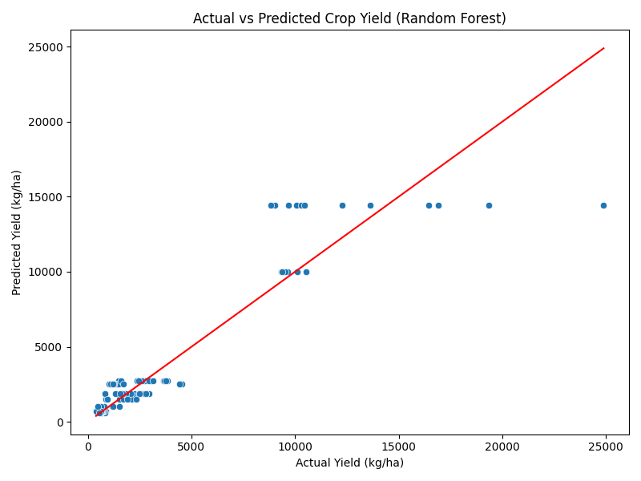
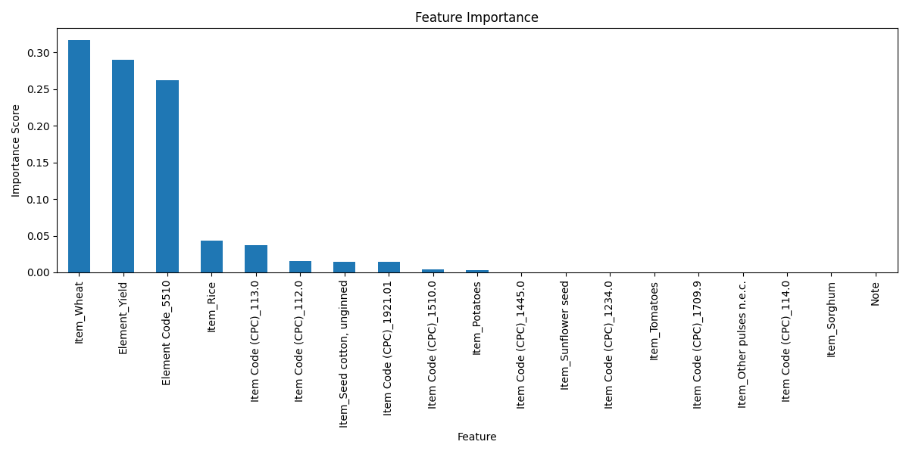

# Crop Yield Prediction in Pakistan

## Overview
This project analyzes historical crop yield data in Pakistan and predicts future crop yields using machine learning.  
It demonstrates data cleaning, preprocessing, feature engineering, model training, evaluation, and feature importance visualization.  

Crop yield prediction is vital for:
- Ensuring food security
- Planning agricultural policies
- Optimizing crop production

---

## Dataset
The dataset contains:
- Crop types (Maize, Wheat, etc.)
- Elements (Yield, Production, etc.)
- Yearly observations from 1961 onward
- Area information (Regions in Pakistan)
- Values in kg/ha

**Source:** [FAO / Pakistan Agriculture Data]  
*(Replace with actual dataset link if publicly available)*

---

## Features
- **Domain Code, Domain:** Categorizes data type
- **Area Code, Area:** Geographical regions
- **Element Code, Element:** Measurement type (Yield, Production)
- **Item Code, Item:** Crop type
- **Year:** Year of observation
- **Value:** Crop yield in kg/ha (target variable)

---

## Project Structure
crop_yield_project/
│
├─ data/ # Original dataset CSV
│ └─ crop_yield_dataset.csv
│
├─ images/ # Plots and visualizations
│ ├─ actual_vs_predicted.png
│ └─ feature_importance.png
│
├─ notebooks/ # Jupyter notebook
│ └─ crop_yield_analysis.ipynb
│
├─ README.md # Project overview
└─ requirements.txt # Python dependencies

---

## Steps Performed
1. **Data Loading & Inspection** – Loaded CSV, checked first rows and dataset info  
2. **Data Cleaning** – Stripped whitespace, handled missing values  
3. **Encoding Categorical Variables** – Converted categorical features to numeric using one-hot encoding  
4. **Train-Test Split & Scaling** – Split dataset into train/test and standardized features  
5. **Model Training** – Random Forest Regressor trained on historical data  
6. **Model Evaluation** – Evaluated using MAE and R², plotted Actual vs Predicted yields  
7. **Feature Importance** – Identified top features contributing to predictions  
8. **Insights** – Derived actionable insights for agricultural planning

---

## Visualizations
### Sample Visualizations





---

## Dependencies
Install required packages using:
```bash
pip install -r requirements.txt
Key Libraries:

pandas

matplotlib

seaborn

scikit-learn

## Future Improvements

Include weather, soil, and irrigation data for better predictions

Explore time series forecasting models

Deploy as a web application for farmers and policymakers

# License

This project is open-source under the MIT License.